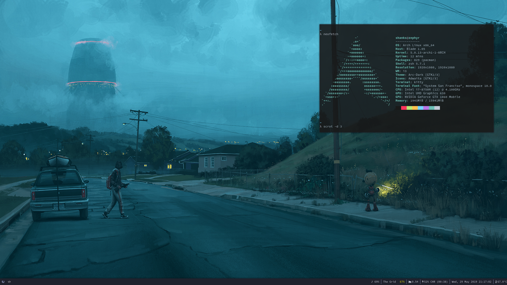

```
     _                 _           __  _       _    __ _ _
 ___| |__   __ _ _ __ | | _____   / /_| | ___ | |_ / _(_) | ___  ___
/ __| '_ \ / _` | '_ \| |/ / __| / / _` |/ _ \| __| |_| | |/ _ \/ __|
\__ \ | | | (_| | | | |   <\__ \/ / (_| | (_) | |_|  _| | |  __/\__ \
|___/_| |_|\__,_|_| |_|_|\_\___/_/ \__,_|\___/ \__|_| |_|_|\___||___/


```

Contains the configurations for the following:

```
1. bash             -- Borne Again! Puff! Not Jason Borne :P
2. vim              -- Vim you lovely motherf**ker.
3. zsh              -- Damn! right. Oh my Zsh!
4. tmux             -- Terminal multiplexer
5. i3               -- The best window manager ever!
6. kitty            -- Cleanest terminal there is.
7. rofi             -- Search in beauty.
```



Let's get started!
