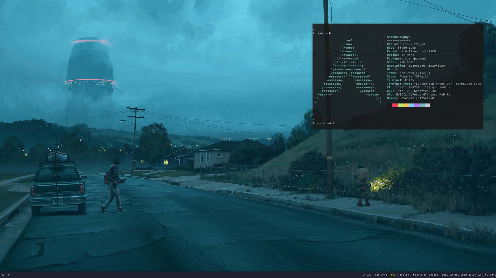

```
     _                 _           __  _       _    __ _ _
 ___| |__   __ _ _ __ | | _____   / /_| | ___ | |_ / _(_) | ___  ___
/ __| '_ \ / _` | '_ \| |/ / __| / / _` |/ _ \| __| |_| | |/ _ \/ __|
\__ \ | | | (_| | | | |   <\__ \/ / (_| | (_) | |_|  _| | |  __/\__ \
|___/_| |_|\__,_|_| |_|_|\_\___/_/ \__,_|\___/ \__|_| |_|_|\___||___/
```

Personal dotfiles, managed with [GNU Stow](https://www.gnu.org/software/stow/).
The core setup is cross-platform; macOS and Linux each add their own layer on top.



## Layout

```
common/   cross-platform stow packages
  nvim/       Neovim — pure Lua, lazy.nvim, LSP via mason, blink.cmp, treesitter
  vim/        classic vim fallback (.vimrc + .vim)
  git/        gitconfig (identity comes from an untracked ~/.gitconfig.local)
  alacritty/  terminal (tokyo night, Iosevka Nerd Font)
  starship/   prompt
  mise/       global tool versions (go, node, python, terraform)
  tmux/       terminal multiplexer
  vscode/     editor settings
mac/      macOS-only packages
  zsh/        zshrc (antidote, fzf-tab, atuin, zoxide, starship)
  aerospace/  tiling window manager
linux/    desktop configs for the Linux box
  i3/ polybar/ dunst/ rofi/ zathura/ kitty/ zsh-legacy/
bin/      small utilities
```

## Setup

Clone first, then follow your OS:

```sh
git clone git@github.com:shashankgroovy/dotfiles.git ~/.dotfiles
cd ~/.dotfiles
```

### macOS

```sh
brew install stow neovim starship mise antidote fzf zoxide atuin direnv \
             eza bat ripgrep lazygit git-delta shellcheck shfmt

# Symlink everything into $HOME
stow -d ~/.dotfiles/common -t ~ nvim vim git starship mise alacritty tmux
stow -d ~/.dotfiles/mac    -t ~ zsh aerospace
```

### Linux

```sh
# Arch shown; use your distro's equivalents (mise and antidote may come
# from the AUR / a git clone / https://mise.run)
sudo pacman -S stow neovim starship fzf zoxide atuin direnv \
               eza bat ripgrep lazygit git-delta shellcheck shfmt

# The cross-platform packages stow the same way
stow -d ~/.dotfiles/common -t ~ nvim vim git starship mise alacritty tmux

# Desktop configs are plain directories — link them into ~/.config
for app in i3 polybar dunst rofi zathura kitty; do
  ln -sfn ~/.dotfiles/linux/$app ~/.config/$app
done
```

The zshrc in `linux/zsh-legacy/` predates the current shell setup and is kept
for reference; `mac/zsh/` is the maintained one and works on Linux too — just
point the antidote `source` line at wherever your distro installs it.

### Finish up (both)

```sh
# Machine-local git identity (not tracked)
printf '[user]\n\tname = Your Name\n\temail = you@example.com\n' > ~/.gitconfig.local
```

Re-running `stow` is idempotent; `stow -D` removes a package's links.
First `nvim` launch bootstraps lazy.nvim and installs plugins pinned by
`lazy-lock.json`; language servers arrive via `:Mason`.
